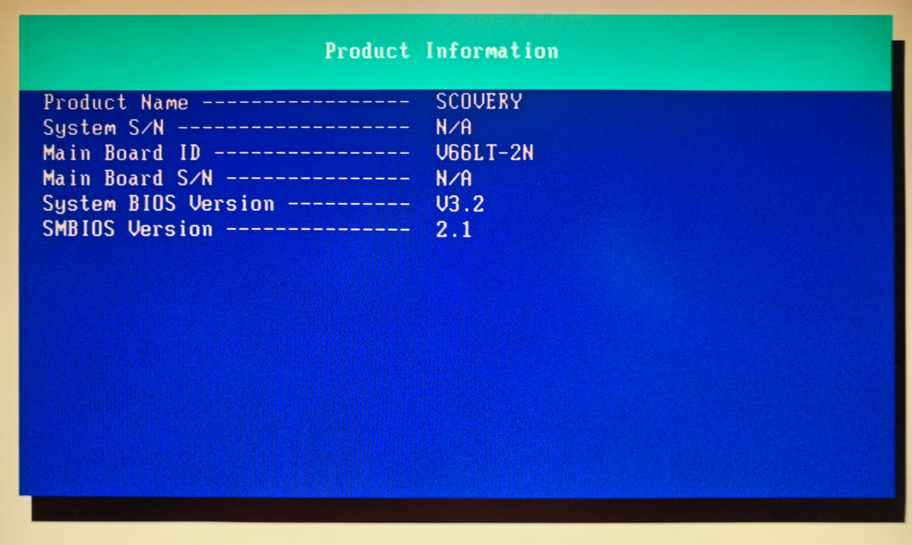

# Siemens SCOVERY V66LT-2N BIOS dump (W29C020)

BIOS dump for Siemens SCOVERY V66LT-2N (Intel 440BX, Pentium III) extracted from a working system. Suitable for recovery, flashing and archival purposes.

BIOS dump extracted from a working Siemens SCOVERY system (manufactured around 1999) equipped with the V66LT-2N motherboard.

The dump was read directly from the Winbond W29C020 BIOS chip using a hardware programmer.

---

## 📄 File details

- File: siemens-scovery-v66lt-2n-bios(W29C020).bin  
- Size: 262144 bytes (256 KB)

---

## 🔐 Checksums

- MD5: 9ae3bfdb80b85b1514f670f0ac18a30b  
- SHA1: ec9959b4dd4612ed72cd96a1a63ca3efa8f0478c  

---

## 🖥️ Hardware context

- System: Siemens SCOVERY  
- Motherboard: V66LT-2N  
- Chipset: Intel 440BX  
- CPU: Intel Pentium II (Slot 1)  
- Graphics: ATI Rage LT Pro (AGP, integrated)  
- BIOS chip: Winbond W29C020  
- Era: late 1990s / early 2000s  
- Typical OS: Windows 98 SE, Windows 2000  

---

## 🔌 Compatibility

This BIOS is intended specifically for Siemens SCOVERY systems with V66LT-2N motherboard (Intel 440BX chipset).  
Do not use on other variants.

---

## 🔧 Usage (BIOS recovery / flashing)

This dump can be used for:

- BIOS recovery using a hardware programmer  
- Restoring corrupted BIOS  
- Reprogramming replacement chips  
- Archival and preservation of legacy hardware  

⚠️ Flashing BIOS always carries a risk.  
Proceed only if you know what you are doing.

---

## 🧰 Tools used

- Hardware programmer: TL866II Plus (XGecu)  
- BIOS chip: Winbond W29C020  

---

## 📦 File integrity verification

After downloading, verify checksums to ensure file integrity:

- MD5: 9ae3bfdb80b85b1514f670f0ac18a30b  
- SHA1: ec9959b4dd4612ed72cd96a1a63ca3efa8f0478c  

---

## 📚 Source

Dump extracted from my own working Siemens SCOVERY system (1999).

Full teardown, photos and hardware analysis:  
👉 https://lepszyserwis.pl/x86_info/siemens-scovery-z-1999-roku-biurowy-komputer-ktory-dzis-swietnie-odnajduje-sie-w-swiecie-retro/

---

## 📝 Notes

- Dump taken from a fully working motherboard  
- No modifications applied  
- Intended for recovery, repair and archival purposes  

---

## ⚖️ License

Provided for archival and educational purposes.  
Use at your own risk.

---

## 🔗 More content

If you're interested in retro PC hardware, BIOS dumps and real-world analysis of old systems:

👉 https://lepszyserwis.pl/  

More articles:  
👉 https://lepszyserwis.pl/x86_info/  
